# 💇‍♀️ Cabeleleila Leila - Sistema de Agendamentos

> Sistema completo de gestão de agendamentos para salão de beleza, com controle de horários, serviços e clientes.

[](https://www.oracle.com/java/)
[](https://spring.io/projects/spring-boot)
[](https://reactjs.org/)
[](https://www.postgresql.org/)
[](https://www.docker.com/)


## 📋 Sobre o Projeto

**Cabeleleila Leila** é uma solução moderna e escalável para gestão de agendamentos em salões de beleza. O sistema resolve problemas reais do dia a dia:

- **Conflito de horários** — visualização clara de disponibilidade
- **Agendamentos duplicados** — validação automática de conflitos
- **Sugestões inteligentes** — consolidação de agendamentos na mesma semana
- **Controle de alterações** — regra de 2 dias para edição pelo cliente
- **Dashboard completo** — métricas e visualização de desempenho semanal

---

## 🎯 Diferenciais Técnicos

### Arquitetura Robusta
- **Separação de responsabilidades** -> backend e frontend totalmente desacoplados
- **API RESTful** -> seguindo boas práticas de design de APIs
- **Autenticação JWT** -> segurança stateless com tokens assinados
- **Autorização baseada em roles** -> CLIENTE vs CABELEIREIRA com permissões distintas

### Segurança
- **Bcrypt** para hash de senhas (10 rounds)
- **JWT com HMAC-SHA256** -> tokens com claim de role
- **CORS configurado** -> proteção contra requisições não autorizadas
- **Validação de roles** -> endpoints protegidos por `@PreAuthorize`
- **Proteção contra escalação de privilégios** -> impossível se cadastrar como CABELEIREIRA via API pública

### Gestão de Estado e Dados
- **JPA/Hibernate**: ORM com mapeamento automático
- **Flyway**: versionamento de schema com migrations
- **Relações N:N**: agendamento com múltiplos serviços
- **Validações de negócio**: regras complexas no service layer


---


### Estrutura do frontend

- Não inclui css aqui no readme para no poluir
- Essa estrutura é só para enteder a lógica do projeto


      src/
      ├── api/
      │   ├── axios.js          
      │   ├── auth.js
      │   ├── servicos.js
      │   └── agendamentos.js
      ├── context/
      │   └── AuthContext.jsx
      ├── pages/
      │   ├── Login.jsx
      │   ├── Cadastro.jsx
      │   ├── cliente/
      │   │   ├── NovoAgendamento.jsx
      │   │   └── MeusAgendamentos.jsx
      │   └── cabeleireira/
      │       ├── Dashboard.jsx
      │       ├── Agendamentos.jsx
      │       └── Servicos.jsx
      ├── components/
      │   ├── PrivateRoute.jsx
      │   ├── Layout.jsx
      │   └── StatusBadge.jsx
      |   └── Button.jsx
      |   └── Modal.jsx
      └── main.jsx'


---


### Estrutura backend


      com.leila.salao/
      ├── config/
      │   └── SecurityConfig.java
      │   └── CorsConfig.java
      ├── security/
      │   └── JwtFilter.java
      ├── service/
      │   ├── JwtService.java
      │   ├── AuthService.java
      │   ├── ServicoService.java
      │   └── AgendamentoService.java
      ├── controller/
      │   ├── AuthController.java
      │   ├── ServicoController.java
      │   ├── AgendamentoController.java
      │   └── DashboardController.java
      ├── repository/
      │   ├── UsuarioRepository.java
      │   ├── ServicoRepository.java
      │   └── AgendamentoRepository.java
      ├── model/
      │   ├── Usuario.java
      │   ├── UsuarioRole.java       
      │   ├── Servico.java
      │   ├── Agendamento.java
      │   └── AgendamentoStatus.java 
      └── dto/
          ├── AuthDTO.javaa
          ├── ServicoDTO.java
          ├── AgendamentoDTO.java
          └── DashboardDTO.java

---

##  Stack Tecnológica

### Backend
| Tecnologia | Versão | Uso |
|-----------|--------|-----|
| **Java** | 21 | Linguagem base |
| **Spring Boot** | 3.x | Framework principal |
| **Spring Security** | 6.x | Autenticação e autorização |
| **Spring Data JPA** | 3.x | Persistência de dados |
| **PostgreSQL** | 15 | Banco de dados relacional |
| **Flyway** | 9.x | Migrations de banco |
| **jjwt** | 0.12.3 | Geração e validação de JWT |
| **Lombok** | 1.18.x | Redução de boilerplate |
| **Maven** | 3.9.x | Gerenciamento de dependências |

### Frontend
| Tecnologia | Versão | Uso |
|-----------|--------|-----|
| **React** | 18.x | Biblioteca UI |
| **Vite** | 5.x | Build tool e dev server |
| **React Router** | 6.x | Roteamento SPA |
| **Axios** | 1.6.x | Cliente HTTP |
| **date-fns** | 3.x | Manipulação de datas |
| **Recharts** | 2.x | Gráficos do dashboard |
| **Lucide React** | 0.x | Ícones |
| **CSS Modules** | - | Estilização scoped |

### DevOps & Ferramentas
| Ferramenta | Uso |
|-----------|-----|
| **Docker** | Containerização do banco local |
| **DBeaver** | Visualização e gestão do banco |
| **Postman** | Testes de API |
| **Git** | Controle de versão |

---

## 🏗️ Arquitetura do Sistema

```
┌─────────────────────────────────────────────────────────────┐
│                      FRONTEND (React)                        │
│  ┌──────────────┐  ┌──────────────┐  ┌──────────────┐      │
│  │   Cliente    │  │ Cabeleireira │  │  Autenticação│      │
│  │  - Agendar   │  │  - Dashboard │  │  - Login     │      │
│  │  - Editar    │  │  - Gerenciar │  │  - Cadastro  │      │
│  └──────────────┘  └──────────────┘  └──────────────┘      │
│           │                │                  │              │
│           └────────────────┴──────────────────┘              │
│                            │                                 │
│                    Axios + JWT Bearer                        │
└────────────────────────────┼────────────────────────────────┘
                             │
                             ▼
┌─────────────────────────────────────────────────────────────┐
│                  BACKEND (Spring Boot)                       │
│  ┌──────────────────────────────────────────────────────┐   │
│  │              Security Layer (JWT Filter)             │   │
│  └──────────────────────────────────────────────────────┘   │
│           │                                                  │
│  ┌────────┴─────────┬──────────────┬──────────────┐        │
│  │   Controllers    │   Services   │ Repositories │        │
│  │  - REST API      │  - Regras de │ - JPA/CRUD   │        │
│  │  - Validação     │    negócio   │              │        │
│  └──────────────────┴──────────────┴──────┬───────┘        │
│                                            │                 │
└────────────────────────────────────────────┼────────────────┘
                                             │
                                             ▼
                                   ┌──────────────────┐
                                   │   PostgreSQL     │
                                   │  (via Docker)    │
                                   └──────────────────┘
```

---

## Sistema de Autenticação JWT

### Fluxo de Autenticação

```
1. Cliente/Cabeleireira → POST /api/auth/login { email, senha }
                             ↓
2. AuthService valida credenciais (Bcrypt)
                             ↓
3. JwtService gera token com claims:
   - subject: UUID do usuário
   - claim "tipo": "CLIENTE" ou "CABELEIREIRA"
   - expiration: 24h
                             ↓
4. Retorna: { token, nome, usuarioId, role }
                             ↓
5. Frontend armazena token no localStorage
                             ↓
6. TODAS requisições incluem: Authorization: Bearer <token>
                             ↓
7. JwtFilter extrai e valida token
                             ↓
8. SecurityContext recebe: Authentication(id, tipo, authorities)
```

### Exemplo de Token JWT

**Header:**
```json
{
  "alg": "HS256",
  "typ": "JWT"
}
```

**Payload:**
```json
{
  "sub": "550e8400-e29b-41d4-a716-446655440000",
  "tipo": "CABELEIREIRA",
  "iat": 1715443200,
  "exp": 1715529600
}
```

**Signature:** HMAC-SHA256(base64UrlEncode(header) + "." + base64UrlEncode(payload), secret)

---

## 📊 Modelo de Dados

### Diagrama ER

```
┌─────────────┐         ┌──────────────┐         ┌─────────────┐
│  usuarios   │         │ agendamentos │         │  servicos   │
├─────────────┤         ├──────────────┤         ├─────────────┤
│ id (PK)     │         │ id (PK)      │    ┌────│ id (PK)      
│ nome        │         │ cliente_id FK├         │ nome        │ 
│ email       │         │ data_hora    │         │ descricao   │
│ senha_hash  │         │ status       │         │ duracao_min │
│ telefone    │         │ observacao   │         │ preco       │
│ role        │         │ criado_em    │         └─────────────┘
│ criado_em   │         └──────┬───────┘               │
└─────────────┘                │                 
                               │                   
                               │ 
                               ▼ 
                    ┌────────────────────────┐
                    │ agendamento_servicos   │
                    ├────────────────────────┤
                    │ agendamento_id (PK,FK) │
                    │ servico_id (PK,FK)     │
                    └────────────────────────┘
                    (associativa)
```

### Enums

**UsuarioRole:**
- `CLIENTE` - pode criar e editar seus próprios agendamentos (regra de 2 dias)
- `CABELEIREIRA` - acesso total ao sistema

**AgendamentoStatus:**
- `PENDENTE` - aguardando confirmação da cabeleieira
- `CONFIRMADO` - confirmado pela cabeleireira
- `CANCELADO` - cancelado (por qualquer parte)

---

## Configuração e Execução

### Pré-requisitos

- Java 21+
- Node.js 18+
- Docker (foi o que eu usei mas se você tiver o postrgreSQL pode fazer por ele direto)
- Maven 3.9+

### 1. Clone o repositório

```bash
git clone https://github.com/seu-usuario/cabeleleila-leila.git
cd cabeleleila-leila
```

### 2. Backend

#### 2.1 Sobe o banco com Docker

```bash
docker-compose up -d
```

Ou manualmente:

```bash
docker run -d \
  --name leila-postgres \
  -e POSTGRES_DB=leila_db \
  -e POSTGRES_USER=leila \
  -e POSTGRES_PASSWORD=leila123 \
  -p 5432:5432 \
  postgres:15
```

#### 2.2 Configura application.properties

```properties
spring.datasource.url=jdbc:postgresql://localhost:5432/leila_db
spring.datasource.username=leila
spring.datasource.password=leila123

jwt.secret=leila-secret-dev-key-2024-muito-segura-aqui
jwt.expiration=86400000
```

#### 2.3 Roda o backend

```bash
cd backend
./mvnw spring-boot:run
```

O backend estará rodando em `http://localhost:8080`

#### 2.4 Visualiza o banco com DBeaver

1. Abre o DBeaver
2. Nova Conexão → PostgreSQL
3. Host: `localhost`, Porta: `5432`
4. Database: `leila_db`
5. User: `leila`, Password: `leila123`

### 3. Frontend

```bash
cd frontend
npm install ou npm i
npm run dev
```

O frontend estará rodando em `http://localhost:5173`

---

## 📮 Testando a API com Postman

### Coleção de Endpoints

#### 1. Cadastro de Cliente

**POST** `http://localhost:8080/api/auth/cadastro`

```json
{
  "nome": "Maria Silva",
  "email": "maria@email.com",
  "senha": "123456",
  "telefone": "11999999999",
  "role": "CLIENTE"
}
```

**Resposta:**
```json
{
  "token": "eyJhbGciOiJIUzI1NiJ9...",
  "nome": "Maria Silva",
  "usuarioId": "550e8400-e29b-41d4-a716-446655440000",
  "role": "CLIENTE"
}
```

---

#### 2. Login

**POST** `http://localhost:8080/api/auth/login`

```json
{
  "email": "maria@email.com",
  "senha": "123456"
}
```

**Resposta:** mesmo formato do cadastro

---

#### 3. Criar Cabeleireira (apenas outra cabeleireira pode fazer)

**POST** `http://localhost:8080/api/auth/admin/criar-cabeleireira`

**Headers:**
```
Authorization: Bearer {TOKEN_DE_CABELEIREIRA_EXISTENTE}
Content-Type: application/json
```

**Body:**
```json
{
  "nome": "Leila Cabeleireira",
  "email": "leila@salao.com",
  "senha": "admin123",
  "telefone": "11987654321"
}
```

---

#### 4. Listar Serviços (público)

**GET** `http://localhost:8080/api/servicos`

**Resposta:**
```json
[
  {
    "id": "uuid-1",
    "nome": "Corte Feminino",
    "descricao": "Corte e escova",
    "duracaoMinutos": 60,
    "preco": 80.00
  },
  {
    "id": "uuid-2",
    "nome": "Coloração",
    "descricao": "Coloração completa",
    "duracaoMinutos": 120,
    "preco": 180.00
  }
]
```

---

#### 5. Criar Serviço (cabeleireira)

**POST** `http://localhost:8080/api/servicos/admin`

**Headers:**
```
Authorization: Bearer {TOKEN_CABELEIREIRA}
Content-Type: application/json
```

**Body:**
```json
{
  "nome": "Escova Progressiva",
  "descricao": "Alisamento profissional",
  "duracaoMinutos": 180,
  "preco": 250.00
}
```

---

#### 6. Buscar Horários Disponíveis

**GET** `http://localhost:8080/api/agendamentos/horarios-disponiveis?data=2026-05-20`

**Resposta:**
```json
[
  "08:00:DISPONIVEL",
  "08:30:DISPONIVEL",
  "09:00:OCUPADO",
  "09:30:DISPONIVEL",
  "10:00:DISPONIVEL",
  ...
]
```

---

#### 7. Criar Agendamento (cliente)

**POST** `http://localhost:8080/api/agendamentos`

**Headers:**
```
Authorization: Bearer {TOKEN_CLIENTE}
Content-Type: application/json
```

**Body:**
```json
{
  "dataHora": "2026-05-20T14:30:00",
  "servicoIds": [
    "uuid-servico-1",
    "uuid-servico-2"
  ],
  "observacao": "Cabelo longo, preferência por escova alisada"
}
```

**Resposta:**
```json
{
  "id": "uuid-agendamento",
  "clienteNome": "Maria Silva",
  "clienteTelefone": "11999999999",
  "dataHora": "2026-05-20T14:30:00",
  "status": "PENDENTE",
  "servicos": [
    {
      "id": "uuid-1",
      "nome": "Corte Feminino",
      "duracaoMinutos": 60,
      "preco": 80.00
    }
  ],
  "observacao": "Cabelo longo, preferência por escova alisada",
  "criadoEm": "2026-05-11T10:30:00",
  "sugestao": null
}
```

---

#### 8. Listar Meus Agendamentos (cliente)

**GET** `http://localhost:8080/api/agendamentos/meus`

**Headers:**
```
Authorization: Bearer {TOKEN_CLIENTE}
```

---

#### 9. Editar Agendamento (cliente - com regra de 2 dias)

**PUT** `http://localhost:8080/api/agendamentos/{id}/cliente`

**Headers:**
```
Authorization: Bearer {TOKEN_CLIENTE}
Content-Type: application/json
```

**Body:**
```json
{
  "dataHora": "2026-05-21T15:00:00",
  "servicoIds": ["uuid-servico-1"],
  "observacao": "Alteração de horário"
}
```

**Erro se < 2 dias:**
```json
{
  "message": "Alteração não permitida. Faltam menos de 2 dias para o agendamento. Entre em contato por telefone."
}
```

---

#### 10. Listar Todos Agendamentos (cabeleireira)

**GET** `http://localhost:8080/api/agendamentos/todos?inicio=2026-05-01&fim=2026-05-31`

**Headers:**
```
Authorization: Bearer {TOKEN_CABELEIREIRA}
```

---

#### 11. Editar Agendamento (cabeleireira - sem restrição)

**PUT** `http://localhost:8080/api/agendamentos/{id}/cabeleireira`

**Headers:**
```
Authorization: Bearer {TOKEN_CABELEIREIRA}
Content-Type: application/json
```

**Body:**
```json
{
  "dataHora": "2026-05-20T16:00:00",
  "servicoIds": ["uuid-servico-1", "uuid-servico-3"],
  "observacao": "Reagendamento solicitado por telefone"
}
```

---

#### 12. Alterar Status (cabeleireira)

**PATCH** `http://localhost:8080/api/agendamentos/{id}/status`

**Headers:**
```
Authorization: Bearer {TOKEN_CABELEIREIRA}
Content-Type: application/json
```

**Body:**
```json
{
  "status": "CONFIRMADO"
}
```

Valores possíveis: `PENDENTE`, `CONFIRMADO`, `CANCELADO`

---

#### 13. Dashboard da Semana (cabeleireira)

**GET** `http://localhost:8080/api/dashboard/semana`

**Headers:**
```
Authorization: Bearer {TOKEN_CABELEIREIRA}
```

**Resposta:**
```json
{
  "totalSemana": 15,
  "confirmados": 10,
  "pendentes": 3,
  "cancelados": 2,
  "agendamentosPorDia": {
    "seg": 3,
    "ter": 2,
    "qua": 4,
    "qui": 1,
    "sex": 5,
    "sáb": 0,
    "dom": 0
  },
  "agendamentos": [
    {
      "id": "uuid",
      "clienteNome": "Maria Silva",
      "clienteTelefone": "11999999999",
      "dataHora": "2026-05-13T14:30:00",
      "status": "CONFIRMADO",
      "servicos": [...],
      "observacao": "...",
      "criadoEm": "2026-05-11T10:00:00"
    }
  ],
  "sugestoes": [
    {
      "clienteNome": "João Santos",
      "clienteTelefone": "11988888888",
      "sugestaoData": "13/05/2026 10:00",
      "agendamentos": [...]
    }
  ]
}
```

---

## 🎨 Funcionalidades por Perfil

### Cliente

- Cadastro público (sempre role CLIENTE)  
- Login  
- Criar agendamentos com seleção visual de horários  
- Ver horários disponíveis/ocupados em tempo real  
- Editar agendamentos (se faltarem mais de 2 dias)  
- Visualizar histórico de agendamentos  
- Receber sugestão de consolidação (mesma semana)  

### Cabeleireira

- Login  
- Dashboard com métricas semanais  
- Gráfico de agendamentos por dia  
- Lista completa de agendamentos da semana  
- Sugestões de consolidação (clientes com 2+ agendamentos)  
- Gerenciar todos os agendamentos (sem restrição de - prazo)  
- Alterar status (PENDENTE → CONFIRMADO/CANCELADO)  

---

## 📜 Regras de Negócio Implementadas

### 1. Validação de Horários Disponíveis

Antes de criar ou editar um agendamento, o sistema:
- Busca todos os agendamentos do dia (exceto CANCELADO)
- Retorna lista de horários com status DISPONIVEL/OCUPADO
- Bloqueia criação se horário já estiver ocupado

### 2. Regra de Alteração (2 dias)

**Cliente:**
- Pode editar agendamento SE `dataHora > now() + 2 dias`
- Caso contrário, retorna erro: "Entre em contato por telefone"

**Cabeleireira:**
- Pode editar qualquer agendamento a qualquer momento

### 3. Sugestão de Consolidação

Ao criar um agendamento:
- Busca outros agendamentos do mesmo cliente na mesma semana.
- Se encontrar, retorna sugestão: "Você já tem agendamento em DD/MM às HH:mm. Deseja agendar na mesma data?"
- Frontend exibe opção de escolher outra data ou manter

### 4. Proteção de Horário no Modal de Edição

Ao editar um agendamento:
- O horário atual do agendamento **sempre** aparece como disponível
- Evita que o sistema bloqueie o próprio horário sendo editado

### 5. Segurança de Cadastro

- Endpoint público `/api/auth/cadastro` **força** `role: CLIENTE`
- Mesmo que alguém envie `role: CABELEIREIRA` na requisição, o backend ignora
- Único jeito de criar CABELEIREIRA: endpoint protegido `/api/auth/admin/criar-cabeleireira`

---

## 🔒 Medidas de Segurança

| Camada | Proteção | Implementação |
|--------|----------|---------------|
| **Senhas** | Bcrypt 10 rounds | `BCryptPasswordEncoder` |
| **Tokens** | JWT HMAC-SHA256 | `jjwt` library |
| **CORS** | Whitelist de origins | `CorsConfigurationSource` |
| **SQL Injection** | Prepared Statements | JPA/Hibernate |
| **CSRF** | Desabilitado (API stateless) | `.csrf(disable)` |
| **Autorização** | Role-based | `@PreAuthorize("hasRole('X')")` |
| **Validação** | Bean Validation | `@Valid` + `@NotNull/@NotEmpty` |

# Telas
  > User

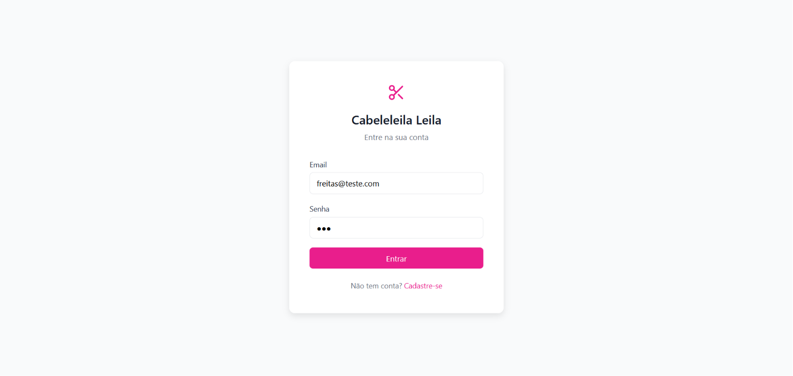

Tela de Login(email e senha) 

---

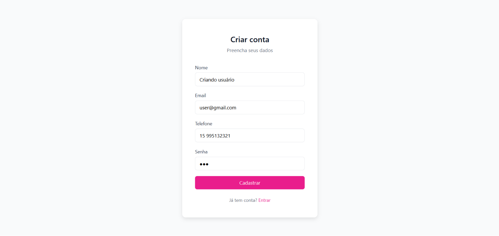


Cadastro, insere email, senha e telefone.


--- 

    Realizando agendamento

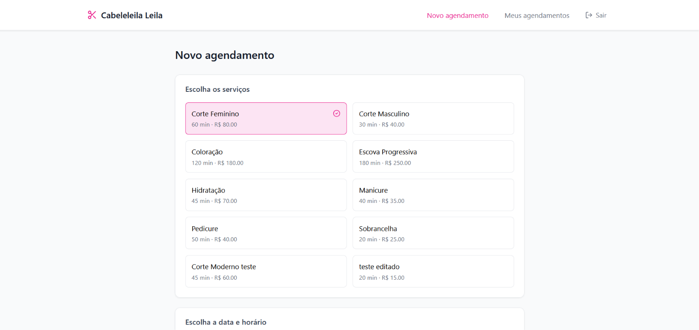

Escolhendo serviço

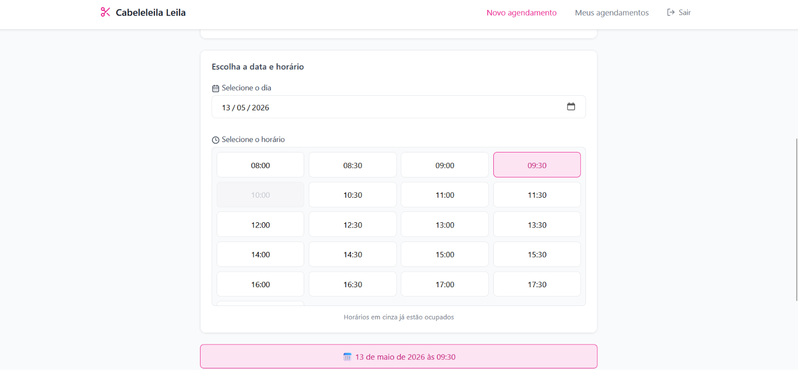

Escolhendo dia e hora do agendamento

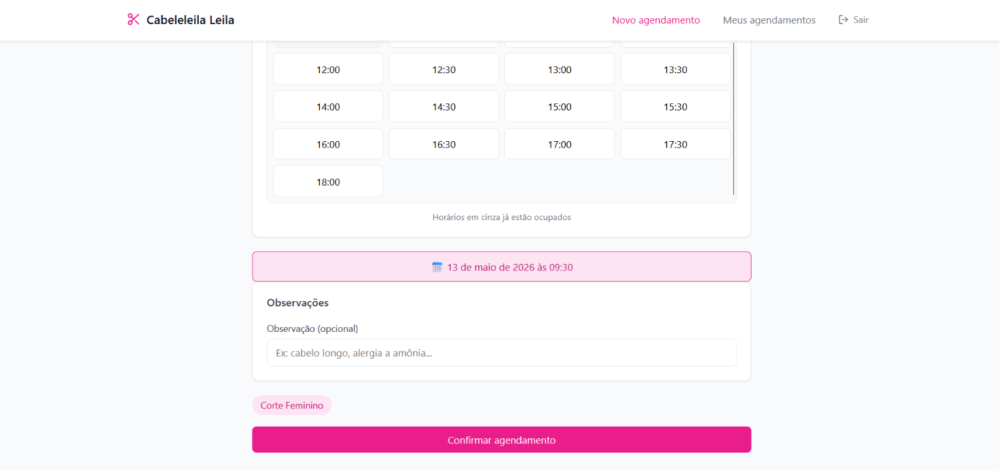

Aqui temos um input com observações caso o cliente deseje dar mais informações sobre o que ele quer.

E  o botão Confirmar agendamento, para confirmar um agendamento.

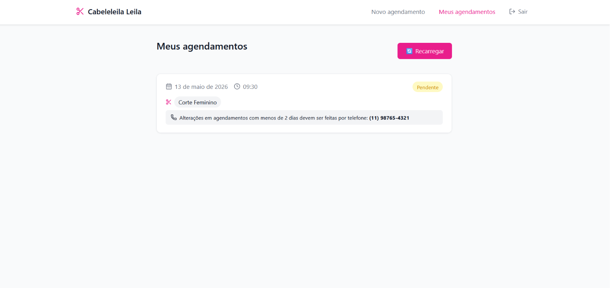

Leva para essa tela de meus agendamentos após confirmar um agendamento. 

Se houveer outro agendamento na mesma semana do mesmo cliente, na hora de realizar um agendamento, aparece uma suguestão do sistema para marcar as sessões no mesmo dia.

    Caso teste:
    
    Estou marcando para o dia 15/05/2026 às 18:00

    Como os prints anteriores, já tinha marcado para o dia 13/05/2026

    Resposta esperada: O sistema sugere ao cliente, agendar os seus agendamentos para o dia 13/05/2026


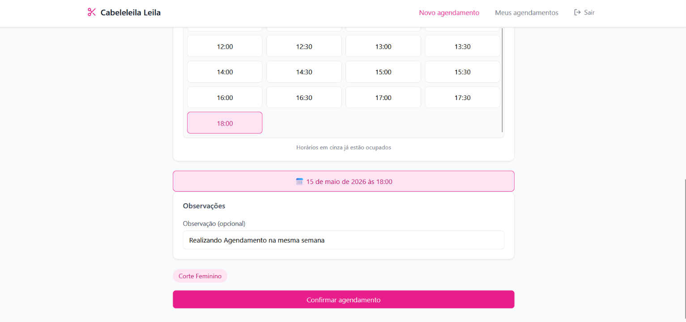

(Indo confirmar agendamento para o dia 15/05/2026)


> Sistema fornce sugestão: 

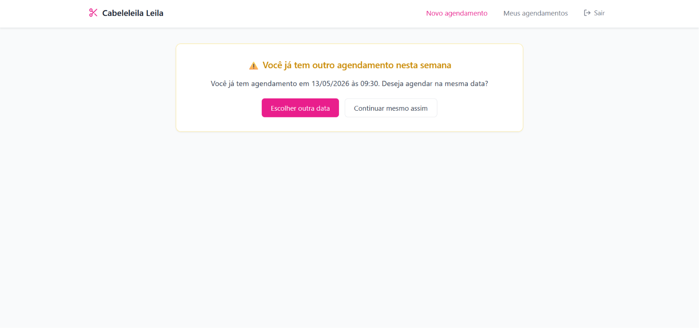


- Há duas opções, escolher outra data: você pode por no mesmo dia do primeiro agendamento, você só deve olhar quais horários estão disponíveis.

- Ou você marca no dia em que estava realizando agendamento, caso deseje.

- Nesse caso, eu optei por continuar mesmo assim, para demostração

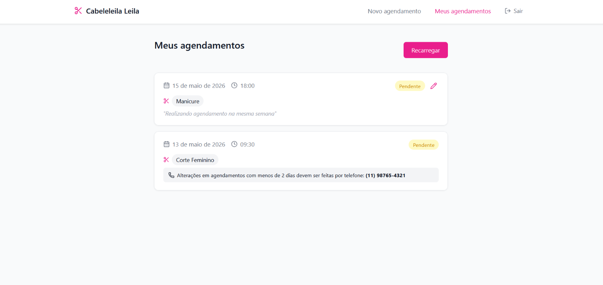

--- 

Possibilidade de editar agendamentos, quando data marcada for maior do que 2 dias do agendado.

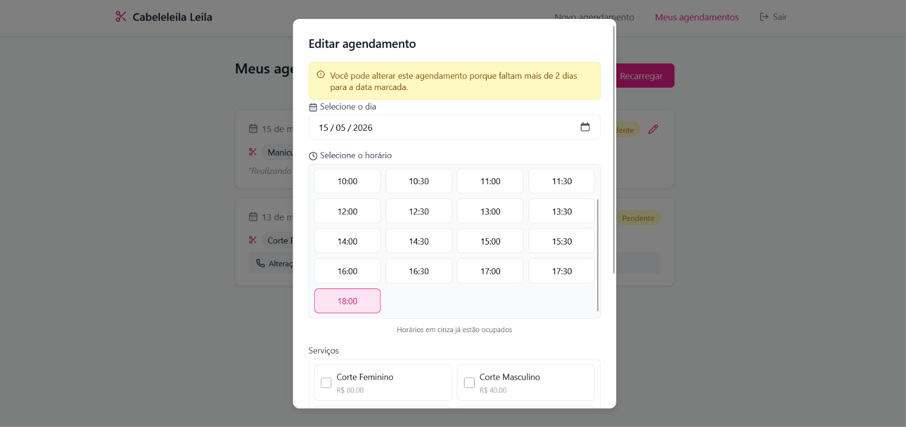

> Entrando como cabeleireira

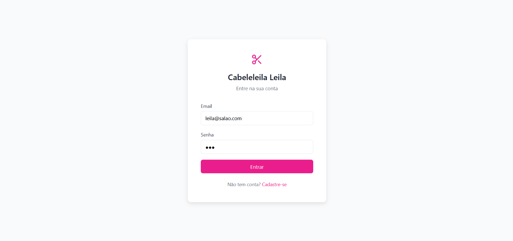

  - visão inicial do dashboard
  - Agendamentos por dia 
  - Nomes dos clientes agendados na semana
  - Sugestões de consolodição(agendandos na memsma semana)

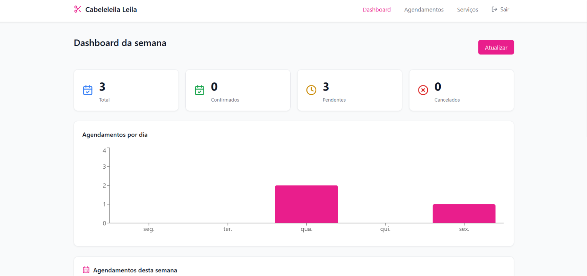
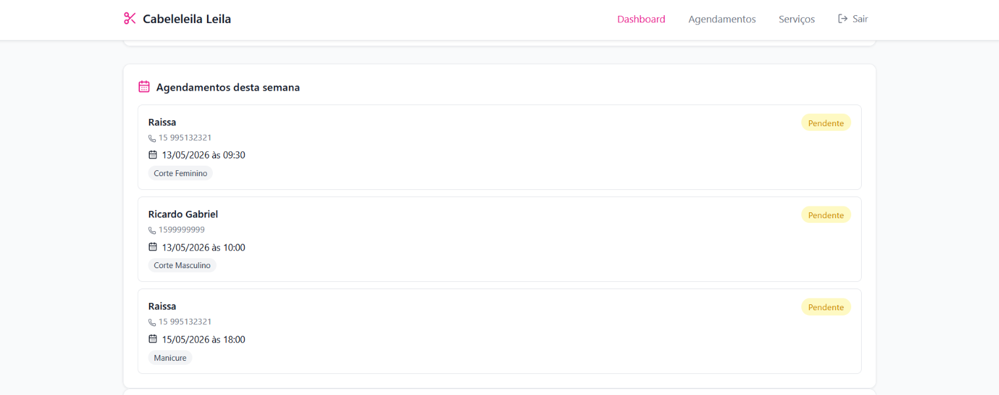
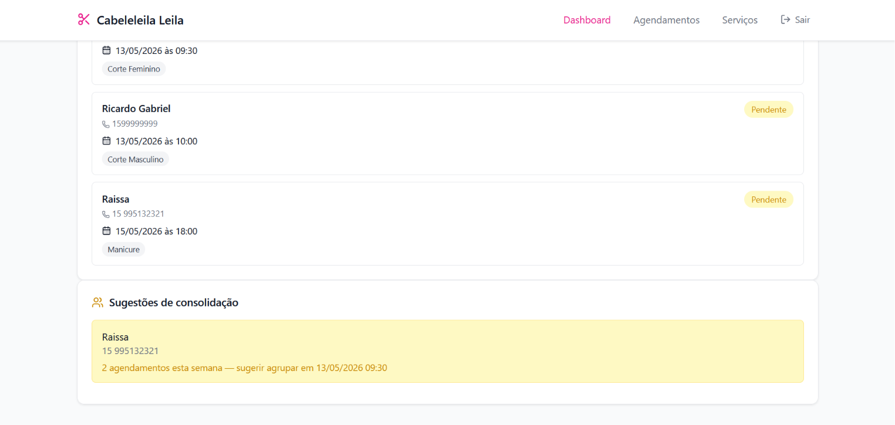

--- 

Buscando os agendamentos por período de tempo

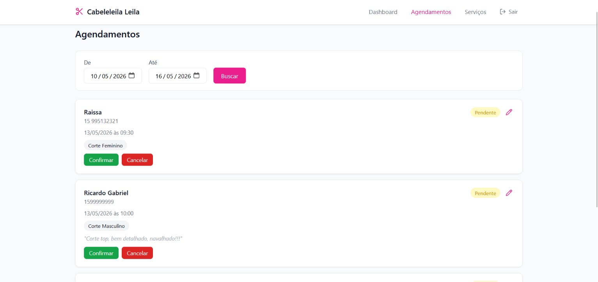

---

Todos os serviços com as opções de editar, adicionar, visualizar, e excluir.

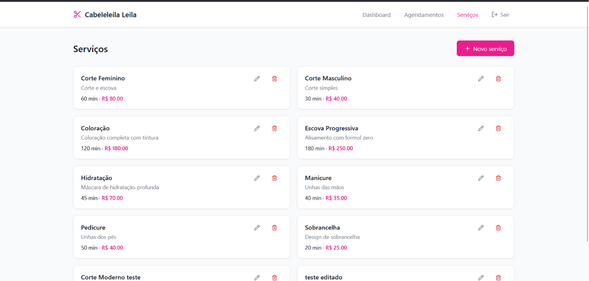


## 👨‍💻 Autor

**Ricardo Gabriel**

- GitHub: [@Ricardo-GabrielX](https://github.com/Ricardo-GabrielX)
- LinkedIn: [ricardogabrieldev](https://www.linkedin.com/in/ricardogabrieldev/)

---


**Desenvolvido com e muito ☕ por Ricardo Gabriel**